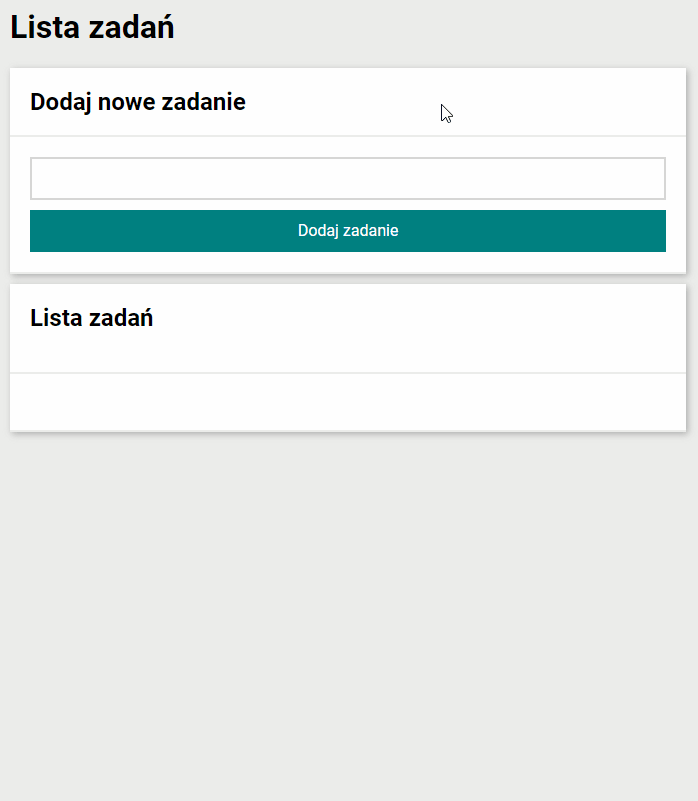

# Marcin Augun - To-do list

## Hi everyone!

Today I present to you my To-do list. Using this tool is a great way to stay organized when we have a lot on our minds. Go ahead and make your day more bearable!

# YouCode

This project is a task within [YouCode](https://youcode.pl/zostawiam-maila/).

YouCode is a frontend development online school with great community.

# Technologies used

    -BEM
    -FLEXBOX
    -ES6+ Features

# Page Preview

# Try it out!

